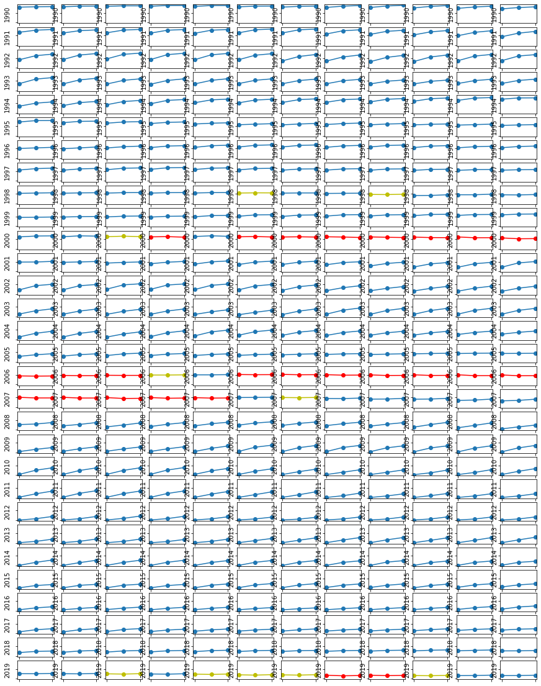

# Recession indicator 

Analysis of the yield of bonds per year and month.

Data is extracted from the [Treasury Department](data.treasury.gov).

Color code:

- Red: ```ten_years < one_year```
- Yellow: ```ten_years - one_year < 0.1```
- Green: yield grows from one year to ten years.


